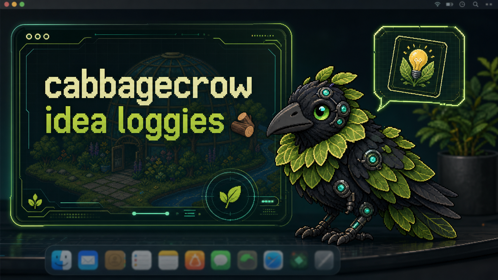

# CabbageCrow Idea Loggies

A standalone macOS desktop pet built with Tauri, React, and TypeScript. CabbageCrow floats on the desktop, reacts through animated modes, can roam in free-range mode, and keeps a playful "idea loggies" bucket for random sparks.



CabbageCrow pairs a tiny desktop companion with an "idea loggies" board: capture stray sparks, let the pet randomly nudge one back into focus, and resolve ideas when they should leave the pool.

Download the macOS app from the [latest GitHub release](https://github.com/cabbageland/cabbagecrow-idea-loggies/releases/latest).

## What Is Included

- Transparent always-on-top CabbageCrow pet window.
- Custom settings and idea loggies dashboard.
- Resizing, dragging, free-range roaming, and reaction modes.
- Apple Shortcuts support through the `cabbagecrow://` URL scheme.
- Sprite atlas pipeline for converting generated pet art into runtime assets.
- macOS app icon and DMG background source assets.

## Development

```bash
npm install
npm run dev
```

Then in another terminal:

```bash
npm run tauri:dev
```

## Build

```bash
npm run build
npm run tauri:build
```

Generated folders such as `node_modules/`, `dist/`, `dist-macos/`, and `src-tauri/target/` are intentionally ignored. They are large, machine-specific outputs that can be recreated from the source.

## Pet Art Pipeline

The CabbageCrow runtime package lives in `public/pets/cabbagecrow/`. The source row art lives in `assets/source/cabbagecrow-rows/`, and the atlas builder is:

```bash
npm run asset:cabbagecrow
```

To adapt this app for another pet, create a new set of row strips with the same action rows, update the pet manifest, and run the atlas builder. The app code reads the packaged sprite sheet and animation metadata rather than depending on the original concept grid.

## Useful Checks

```bash
npm test -- --run
npm run build
```

See `docs/apple-shortcuts.md` for Apple Shortcuts integration notes.
